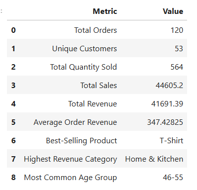

# 🛍️ Retail Sales Data — Exploratory Data Analysis

## 📌 Project Overview

This project performs an **Exploratory Data Analysis (EDA)** on retail sales data to identify sales trends, customer behaviour patterns, product performance, and actionable business insights.

The analysis uses Python-based data analysis and visualization techniques to transform raw transaction data into meaningful insights that can support business decision-making.

---
## 📌 EDA Summary



### 🔍 Quick Overview

This EDA analyzes **120 retail transactions** to understand:
- 📈 Monthly and quarterly sales trends
- 👥 Customer age and gender distribution
- 🛍️ Top 10 best-selling products
- 💰 Revenue performance across product categories
- 🔗 Relationships between numerical variables
- 🎯 Category-wise customer behavior

---

## 🎯 Objectives

The primary objectives of this project are to:

* Understand the structure and quality of the retail dataset
* Perform data cleaning and preprocessing
* Calculate descriptive statistics for numerical variables
* Analyze monthly and quarterly sales trends
* Understand customer demographics by age and gender
* Identify the top-selling products
* Analyze revenue contribution by product category
* Examine relationships between numerical variables using correlation analysis
* Discover additional customer and product behaviour patterns
* Develop actionable business recommendations

---

## 🗂️ Dataset

The dataset contains **120 retail transactions** with information related to orders, customers, products, sales, pricing, discounts, and revenue.

### Key Features

| Feature            | Description                |
| ------------------ | -------------------------- |
| `Order_ID`         | Unique order identifier    |
| `Date`             | Transaction date           |
| `Customer_ID`      | Unique customer identifier |
| `Gender`           | Customer gender            |
| `Age`              | Customer age               |
| `Product`          | Purchased product          |
| `Category`         | Product category           |
| `Quantity`         | Quantity purchased         |
| `Unit_Price`       | Price per unit             |
| `Sales`            | Gross sales amount         |
| `Discount_Percent` | Discount percentage        |
| `Discount_Amount`  | Discount amount            |
| `Revenue`          | Net revenue after discount |

---

## 🛠️ Technologies Used

- Python
- Pandas
- NumPy
- Matplotlib
- Seaborn
- Jupyter Notebook

## 📊 Analysis Performed

### 1. Dataset Inspection
- Dataset shape
- Data types
- Missing values
- Duplicate records

### 2. Descriptive Statistics
- Mean
- Median
- Mode
- Standard deviation

### 3. Sales Trend Analysis
- Monthly sales trends
- Quarterly sales trends

### 4. Customer Analysis
- Age-group distribution
- Gender breakdown

### 5. Product Analysis
- Top 10 best-selling products
- Revenue by product category

### 6. Correlation Analysis
- Correlation matrix
- Numerical-variable heatmap

### 7. Additional Insight
- Revenue by product category and gender

## 💡 Key Business Insights

The analysis helps identify:
- High-performing sales periods
- Dominant customer age groups
- Gender-wise purchasing patterns
- Best-selling products
- Highest-revenue product categories
- Relationships between quantity, pricing, discounts, sales, and revenue

## 🚀 Business Recommendations

1. **Focus inventory on best-selling products** to reduce stock-outs and improve availability.
2. **Prioritize high-revenue categories** through targeted promotions and product expansion.
---

## 📁 Project Structure

```text
Task3_Retail_Sales_EDA/
│
├── Retail_Sales_EDA.ipynb
├── retail_sales_eda_dataset.csv
├── EDA-summary.png
└── README.md
```

---

## 🚀 How to Run

### 1. Clone the repository

```bash
git clone https://github.com/ig-animesh/OIBSIP.git
```

### 2. Navigate to the project

```bash
cd OIBSIP/Task3_Retail_Sales_EDA
```

### 3. Install required libraries

```bash
pip install pandas numpy matplotlib seaborn jupyter
```

### 4. Launch Jupyter Notebook

```bash
jupyter notebook
```

Open:

```text
Retail_Sales_EDA.ipynb
```

and run the cells sequentially.

---

## 📊 Project Outcome

This project demonstrates practical skills in:

* Exploratory Data Analysis
* Data Cleaning
* Statistical Analysis
* Data Visualization
* Time-Series Analysis
* Customer Segmentation
* Product Analysis
* Correlation Analysis
* Business Insight Generation
* Python & Pandas

The project converts raw retail transaction data into visual and analytical insights that can support data-driven business decisions.

---

## 👨‍💻 Author

**Animesh Kumar Halder**

### Skills Demonstrated

`Python` · `Pandas` · `NumPy` · `Matplotlib` · `Seaborn` · `EDA` · `Data Analysis` · `Data Visualization`

---
## 🏢 Internship

**Oasis Infobyte — Data Analytics Internship**

**Level 1 • Task 1 — Retail Sales EDA**


