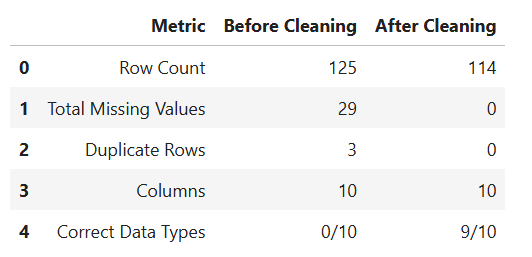
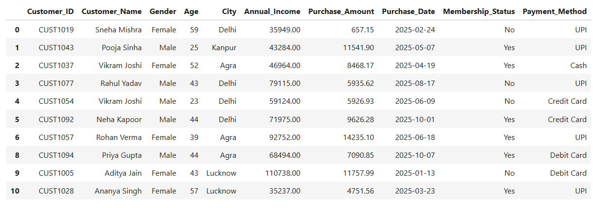
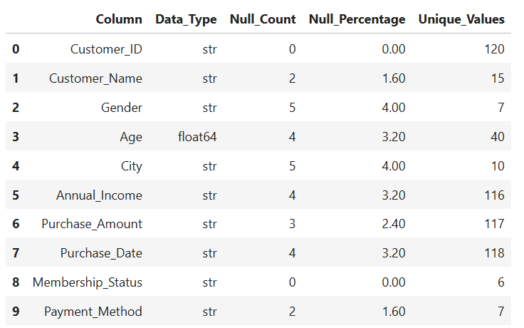
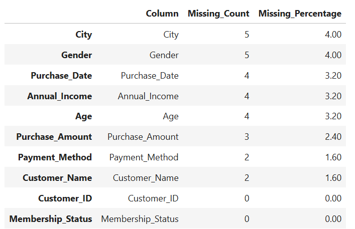
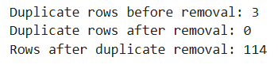
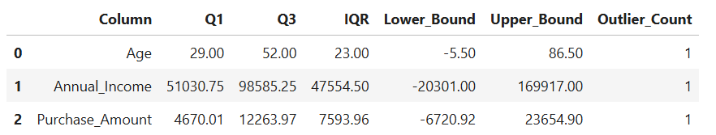

# 🧹 Customer Sales Data Cleaning & Preprocessing

> **Transforming a messy customer sales dataset into a clean, validated, analysis-ready dataset using Python & Pandas.**

---

## ⚡ Project at a Glance

| 🔎 Area | 📌 Details |
|---|---|
| **Project** | Customer Sales Data Cleaning |
| **Objective** | Clean, validate & prepare raw customer sales data |
| **Raw Dataset** |`dataset/Messy_Customer_sales.csv` — **125 rows × 10 columns** |
| **Final Dataset** |`cleaned_customer_sales.csv` - **114 rows × 10 columns** |
| **Data Quality** | **0 missing values • 0 duplicate records** |
| **Key Checks** | Missing Values • Duplicates • Outliers • Data Consistency |
| **Tools** | Python • Pandas • Matplotlib • Jupyter • Excel |
| **Output** | Cleaned & analysis-ready customer sales dataset |

### 🔄 Cleaning Pipeline

**Raw Data → Quality Assessment → Missing Value Analysis → Duplicate Detection → Outlier Analysis → Cleaning → Validation → Final Dataset**

---

# 📊 Before vs After

The raw customer sales dataset was inspected and cleaned to address data-quality issues and produce a reliable dataset for further analysis.



### ✅ Cleaning Result

- **125 → 114 records**
- **10 columns retained**
- **0 missing values**
- **0 duplicate records**
- Clean and structured dataset ready for analysis

---

# 🧾 Final Cleaned Dataset

The cleaned dataset was exported after completing the preprocessing and validation workflow.



📁 **Output:** `dataset/cleaned_customer_sales.csv`

---

# 🔍 Data Quality Analysis

The raw dataset was profiled to identify potential data-quality issues before applying cleaning operations.



This assessment helped identify areas requiring preprocessing and validation.

---

# 🧩 Missing Value Analysis

Missing values were identified and handled as part of the data-cleaning process.



### Final Result

**Missing Values: 0**

---

# ♻️ Duplicate Detection

The dataset was checked for duplicate records to prevent repeated observations from affecting future analysis.



### Final Result

**Duplicate Records: 0**

---

# 📈 Outlier Analysis

Numerical variables were examined for potential outliers and unusual observations as part of the overall data-quality assessment.



Outlier analysis helped understand unusual observations before finalizing the cleaned dataset.

---

# 🛠️ Data Cleaning Workflow

The project followed a structured preprocessing pipeline:

```text
                RAW CUSTOMER DATA
                       │
                       ▼
                Data Inspection
                       │
                       ▼
             Data Quality Assessment
                       │
          ┌────────────┼────────────┐
          ▼            ▼            ▼
     Missing Values  Duplicates   Outliers
          │            │            │
          └────────────┼────────────┘
                       ▼
              Data Cleaning &
               Standardization
                       │
                       ▼
                 Validation
                       │
                       ▼
              CLEANED DATASET
                       │
                       ▼
          Analysis-Ready Customer Data
```

---

# 🔧 Key Data Cleaning Steps

### 1. Data Inspection

- Examined dataset structure and dimensions
- Reviewed column names and data types
- Checked unique values and overall data quality

### 2. Missing Value Handling

- Identified missing values
- Applied appropriate preprocessing techniques
- Re-checked the dataset after cleaning

### 3. Duplicate Detection

- Identified duplicate records
- Handled duplicate observations
- Validated the final dataset for uniqueness

### 4. Data Consistency

- Reviewed inconsistent or invalid values
- Standardized data where required
- Ensured a consistent dataset structure

### 5. Outlier Analysis

- Examined numerical variables for unusual observations
- Used visual/statistical checks to understand potential outliers
- Avoided blindly removing valid observations

### 6. Final Validation

- Rechecked missing values
- Rechecked duplicate records
- Verified dataset structure
- Exported the cleaned dataset

---

# 📂 Project Structure

```text
DataAnalytics-L1-Task3-Cleaning-Data/
│
├── 📁 dataset/
│   ├── Messy_Customer_Sales.xlsx
│   ├── cleaned_customer_sales.xlsx
│   └── cleaned_customer_sales.csv
│
├── 📁 notebook/
│   └── Data_Cleaning.ipynb
│
├── 📁 screenshots/
│   ├── Before-After.png
│   ├── Final-Cleaned-Data.png
│   ├── Data-Quality-Report.png
│   ├── Missing-value-Analysis.png
│   ├── Duplicate-detection.png
│   └── Outlier.png
│
└── README.md
```

---

# 🛠️ Tech Stack

| Technology | Usage |
|---|---|
| 🐍 **Python** | Data cleaning & preprocessing |
| 🐼 **Pandas** | Data manipulation & transformation |
| 📓 **Jupyter Notebook** | Analysis & documentation |
| 📗 **Excel / CSV** | Dataset storage & output |

---

# 📊 Dataset

The customer sales dataset contains information related to customer demographics, purchasing behavior, and transaction details.

### Dataset Transformation

**Raw Dataset:** 125 rows × 10 columns
📁 **Raw Dataset:** `dataset/Messy_Customer_sales.csv`

⬇️ Data Cleaning & Validation

**Final Dataset:** 114 rows × 10 columns

The cleaned dataset 📗 is available: - `cleaned_customer_sales.csv`

---

# 🚀 How to Run

### 1. Clone the repository

```bash
git clone https://github.com/ig-animesh/OIBSIP.git
```

### 2. Navigate to the project

```bash
cd OIBSIP/DataAnalytics-L1-Task3-Cleaning-Data
```

### 3. Install dependencies

```bash
pip install pandas matplotlib openpyxl jupyter
```

### 4. Launch Jupyter Notebook

```bash
jupyter notebook
```

Open:

```text
notebook/Data_Cleaning.ipynb
```

---

# 🎯 Key Takeaways

This project demonstrates a complete **data cleaning and preprocessing workflow**, from identifying data-quality issues to validating and exporting a final analysis-ready dataset.

### Skills Demonstrated

`Python` `Pandas` `Data Cleaning` `Data Preprocessing` `Data Validation` `Data Quality Analysis` `Data Analysis` `Excel`

---

# 👨‍💻 Author

**Animesh Kumar Halder**

**BCA | Aspiring Data Analyst**

Interested in **Data Analytics, Business Intelligence & Machine Learning**

---

## 🏢 Internship

**Oasis Infobyte — Data Analytics Internship**

**Level 1 • Task 3 — Cleaning Data**
