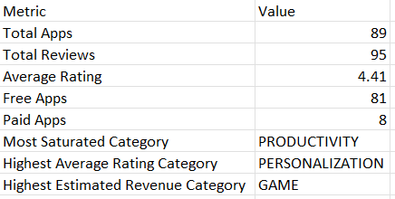
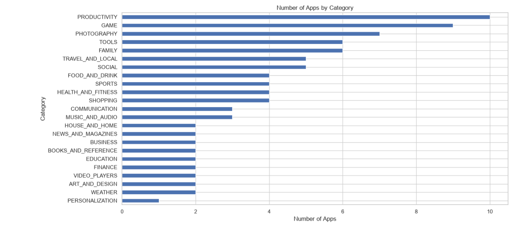
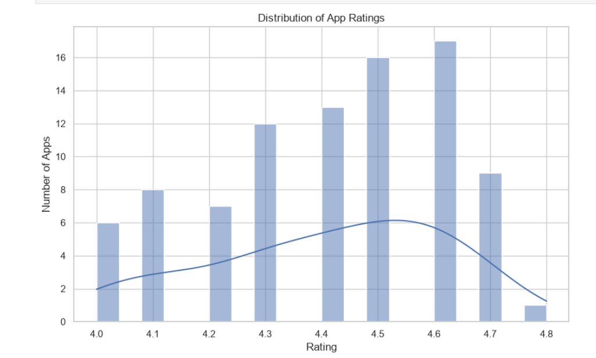
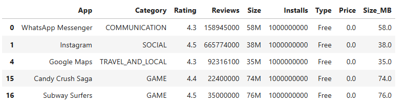
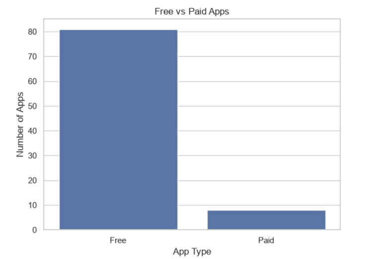
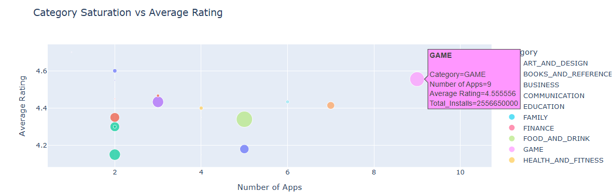
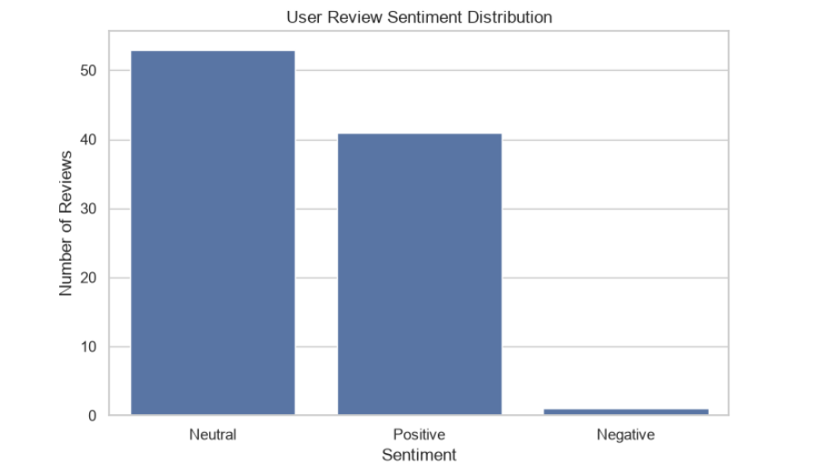

# 📱 Google Play Store Data Analysis

## 📌 Project Overview

This project analyzes Google Play Store application data to identify meaningful patterns and insights related to app ratings, installs, reviews, categories, pricing, size, and user sentiment.

The project includes data cleaning, preprocessing, exploratory data analysis, visualization, and sentiment analysis using Python.

---

## 🎯 Objectives

- Analyze the distribution of apps across different categories
- Study app ratings and user reviews
- Analyze installation trends
- Compare free and paid applications
- Explore the relationship between app size and installs
- Analyze pricing and estimated revenue of paid applications
- Perform sentiment analysis on user reviews
- Generate meaningful business insights from the data

---

## 🛠️ Technologies Used

- **Python**
- **Pandas**
- **NumPy**
- **Matplotlib**
- **Plotly**
- **Jupyter Notebook**

---

## 📂 Dataset

The project uses two Google Play Store datasets:

- [`play_store_apps.csv`](./play_store_apps.csv) — Contains application information such as category, rating, reviews, installs, price, size, and type.
- [`play_store_reviews.csv`](./play_store_reviews.csv) — Contains user reviews and sentiment information.

---

## 🔍 Analysis Performed

### 1. Data Cleaning & Preprocessing

- Handled missing values
- Removed duplicate records
- Cleaned numerical columns
- Converted columns into appropriate data types
- Processed app size, installs, and price values
- Prepared review data for sentiment analysis

### 2. Exploratory Data Analysis

The analysis covers:

- Category distribution
- Rating distribution
- Size vs Installs
- Free vs Paid applications
- Interactive visualizations
- User sentiment distribution

### 3. Business Insights

The analysis provides insights into:

- Popular Google Play Store categories
- Distribution of app ratings
- Relationship between app size and installations
- Differences between free and paid apps
- User sentiment and review patterns
- Pricing and estimated revenue trends

---

# 📊 Final Summary



---

# 📸 Screenshots

## 1. Category Distribution



---

## 2. Rating Distribution



---

## 3. Size vs Installs



---

## 4. Free vs Paid Apps



---

## 5. Interactive Plotly Visualization



---

## 6. Sentiment Distribution



---

# 📓 Project Notebook

The complete analysis and code are available in:

[`Google_Play_Store_Analysis.ipynb`](./Google_Play_Store_Analysis.ipynb)

---

# 🚀 How to Run

### 1. Clone the repository

```bash
git clone https://github.com/yourusername/OBSIP.git
